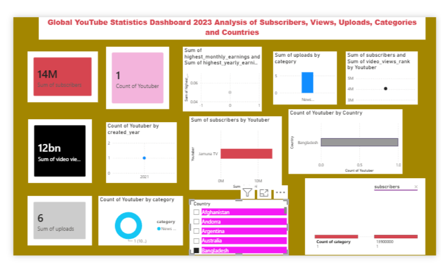

# 📺 Global YouTube Statistics Dashboard 2023

## 📌 Project Overview

This Power BI dashboard provides an interactive analysis of global YouTube channel statistics. It helps users understand channel performance by analyzing subscribers, video views, uploads, categories, countries, and earnings. The dashboard is designed to deliver meaningful insights through clear and interactive visualizations.

---

## 🎯 Objectives

* Analyze the performance of YouTube channels worldwide.
* Compare subscribers, video views, and uploads.
* Identify the most popular content categories.
* Analyze channel distribution across different countries.
* Explore the relationship between subscribers and video views.

---

## 📊 Dashboard Features

* KPI Cards

  * Total Subscribers
  * Total Video Views
  * Total Uploads
  * Total Channels

* Visualizations

  * Top Channels by Subscribers
  * Subscribers by Category (Treemap)
  * Channels by Country (Bar Chart)
  * Channels by Category (Donut Chart)
  * Subscribers vs Video Views (Scatter Chart)
  * Channel Creation Trend (Line Chart)

* Interactive Slicer

  * Country

---

## 🛠️ Tools Used

* Power BI Desktop
* Power Query
* DAX
* Data Modeling

---

## 📂 Dataset

**Dataset:** Global YouTube Statistics 2023

Source: Kaggle

---

## 📈 Key Insights

* Identified the channels with the highest subscriber count.
* Compared video views and subscriber growth.
* Analyzed the most popular YouTube content categories.
* Compared channel distribution across countries.
* Visualized channel performance using interactive charts.

---

## 📸 Dashboard Preview

---

## 🚀 Skills Demonstrated

* Data Cleaning
* Data Transformation
* Data Visualization
* Dashboard Design
* DAX Measures
* Business Insights
* Interactive Reporting

---

## 👨‍💻 Author

**Mahalakshmi D**

Aspiring Data Analyst | Power BI | SQL | Excel
